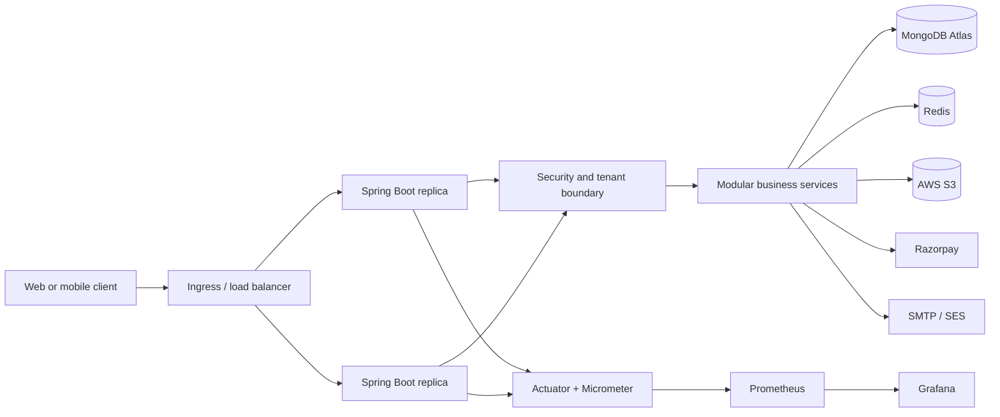

# System Design

## Design goal

Provide a secure, multi-tenant society-management API that remains simple to operate as a monolith, scales horizontally for read-heavy community activity, and keeps payment and notification failures from corrupting core business state.

## High-level architecture



The current application is one deployable Spring Boot process. Multiple replicas are possible because authentication is stateless and shared state is externalized to MongoDB/Redis.

## Request flow: authenticated read/write

```text
Client
  -> load balancer
  -> rate-limit filter
  -> JWT authentication filter
  -> subscription/tenant enforcement
  -> controller + DTO validation
  -> service authorization and state transition
  -> repository query scoped to society
  -> MongoDB
  -> response
```

The service layer is the critical boundary: it must enforce tenant isolation and business rules even when a controller is accidentally called from another entry point.

## Payment flow

```text
Resident -> API: request payment
API -> MongoDB: verify bill and current status
API -> Razorpay: create/order or payment operation
Razorpay -> Client/API: provider result
Razorpay -> API webhook: signed event
API -> API: verify webhook signature
API -> MongoDB: idempotently mark payment state
API -> email: notify asynchronously where possible
```

Important interview points:

- The webhook is the durable provider confirmation, not only the browser response.
- Store provider IDs and a processed-event/idempotency key.
- Reject invalid signatures and duplicate events safely.
- Never expose payment secrets to the client.

## Notification and document flows

### Email

The API should commit the business change first, then publish a durable notification job/event. A worker sends the email with bounded retries. If the current implementation sends directly, identify that as a reliability improvement rather than claiming it already has a queue.

### Files

Upload bytes directly to S3 using a short-lived presigned URL. Persist only metadata and the object key in MongoDB. Check tenant ownership before issuing a download URL, and never make private objects public just to simplify access.

## Data design

MongoDB is a good fit for flexible society and resident documents, but query patterns must drive indexes. Typical indexes should cover:

- society/tenant identifier plus frequently filtered status fields;
- user email or login identifier;
- bill owner plus billing period and payment status;
- complaint status, priority, and creation time;
- provider event/payment identifiers for idempotency.

The exact indexes should be verified against repository queries and production query plans. Avoid recommending indexes only from entity names.

## Scaling plan

### Current scale-out path

1. Run two or more stateless API replicas.
2. Put a load balancer/Ingress in front.
3. Use shared MongoDB Atlas and Redis.
4. Configure readiness/liveness probes and HPA.
5. Monitor latency, error rate, saturation, MongoDB pool usage, Redis errors, and provider failures.

### Likely bottlenecks

- MongoDB connection pool and unbounded list queries.
- Synchronous email or payment-provider latency consuming request threads.
- Hot tenants or announcement/issue feeds without pagination and indexes.
- Redis availability if rate limiting is fail-closed.
- External provider quotas and webhook delays.

### Evolution path

Add pagination and projections, cache safe read-heavy data, move email/payment reconciliation to workers, introduce an outbox for durable events, and extract a module only after its load or ownership boundary is demonstrated.

## Reliability and failure decisions

| Failure | Safe behavior |
|---|---|
| MongoDB unavailable | Fail writes clearly; do not claim success; allow health/readiness to expose the dependency state appropriately |
| Redis unavailable | Use an explicit rate-limit policy; avoid silently disabling abuse protection for sensitive endpoints |
| Email provider unavailable | Keep the business record committed; retry a notification job and expose delivery status |
| Payment provider timeout | Mark payment as pending/unknown; reconcile through webhook/status lookup |
| Duplicate webhook | Return success after detecting the processed provider event |
| One API replica dies | Load balancer routes to another replica; no in-memory session is required |
| Invalid tenant access | Return authorization failure without revealing whether another tenant's record exists |

## Trade-offs to explain

- **Modular monolith vs microservices:** lower operational complexity and easier local transactions now; less independent scaling and stronger module boundaries required.
- **MongoDB vs relational database:** flexible documents and rapid domain evolution; joins, cross-document transactions, and reporting need deliberate design.
- **JWT vs server sessions:** horizontal scalability and no session lookup; revocation and rotation require additional strategy.
- **Redis rate limiting:** shared enforcement across replicas; introduces a dependency and requires an outage policy.
- **Direct provider calls vs asynchronous jobs:** simpler initial code versus higher latency and weaker retry/reliability characteristics.
