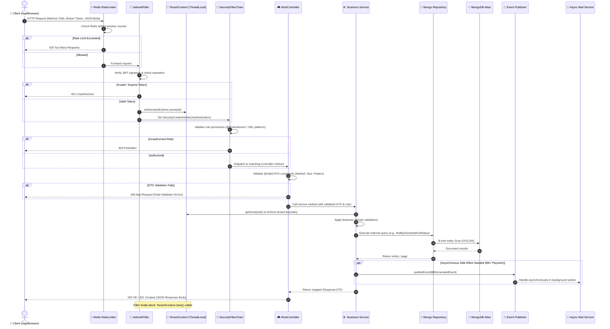

# CivicLink Backend Architecture & Request Flow (`flowDiagram.md`)

This document provides a comprehensive end-to-end architecture and request lifecycle diagram for the **CivicLink Society Management** backend platform.

---

## 1. High-Level Architecture Flow Diagram

The diagram below shows the flow starting from the **User Block**, through network transmission, entering the **Application / Backend Block**, traversing each internal layer, interacting with persistence & external cloud services, and finally returning structured HTTP responses back to the user.

```mermaid
graph TD
    %% ==========================================
    %% USER BLOCK
    %% ==========================================
    subgraph UserBlock["👤 1. USER & CLIENT BLOCK"]
        ResidentUser["📱 Resident<br/>Mobile App & Web"]
        AdminUser["💻 Society Admin<br/>Admin Portal"]
        SuperAdminUser["🛡️ Platform Admin<br/>Platform Console"]
        GateSecurity["🛂 Security Guard<br/>Gate Tablet"]
        RazorpayWebhook["💳 Razorpay<br/>Payment Webhooks"]
    end

    %% ==========================================
    %% NETWORK & REQUEST TRANSMISSION
    %% ==========================================
    UserBlock -->|"1. HTTPS Request<br/>• Bearer JWT Auth<br/>• JSON / Multipart"| ApplicationBlock

    %% ==========================================
    %% APPLICATION / BACKEND BLOCK
    %% ==========================================
    subgraph ApplicationBlock["🏢 2. APPLICATION / BACKEND BLOCK (Spring Boot 3.5 / Java 21)"]

        %% Ingress & Security Filters
        subgraph FilterPipeline["🛡️ A. Edge & Security Filters"]
            CorsFilter["🌐 CorsFilter<br/>Allowed Origins"]
            LoggingFilter["📝 RequestLoggingFilter<br/>Trace ID & Latency"]
            RateLimiterFilter["⚡ RedisRateLimiter<br/>Sliding Window Limit"]
            JwtFilter["🔐 JwtAuthFilter<br/>Signature & Claims"]
            SecurityFilterChain["🚦 SecurityFilterChain<br/>RBAC Permissions"]

            CorsFilter --> LoggingFilter --> RateLimiterFilter --> JwtFilter --> SecurityFilterChain
        end

        %% Context Isolation
        subgraph TenantLayer["🏢 B. Multi-Tenant Context"]
            TenantContextHolder["🧵 TenantContext<br/>ThreadLocal societyId<br/>Guaranteed Cleanup"]
        end

        %% Controllers
        subgraph ControllerLayer["🎮 C. REST API Controller Layer"]
            AuthController["🔑 AuthController<br/>/api/v1/auth"]
            AdminController["👥 AdminController<br/>/api/v1/users"]
            SocietyController["🏛️ SocietyController<br/>/api/v1/societies"]
            FlatController["🚪 FlatController<br/>/api/v1/flats"]
            ComplaintController["🧾 ComplaintController<br/>/api/v1/complaints"]
            AnnouncementController["📢 AnnouncementController<br/>/api/v1/announcements"]
            IssueController["🗳️ IssueController<br/>/api/v1/issues"]
            FinanceController["💳 FinanceController<br/>/api/v1/finance"]
            SubscriptionController["📦 SubscriptionController<br/>/api/v1/subscriptions"]
            DashboardController["📊 DashboardController<br/>/api/v1/dashboard/stats"]
            WebhookController["⚡ WebhookController<br/>/api/v1/webhooks"]
        end

        %% Global Exception Handler
        subgraph ExceptionLayer["⚠️ D. Centralized Error Handling"]
            GlobalExceptionHandler["GlobalExceptionHandler<br/>Validation (400) • Auth (403)<br/>NotFound (404) • Server (500)"]
        end

        %% Business Service Layer
        subgraph ServiceLayer["⚙️ E. Business Logic & Services"]
            AuthService["AuthService<br/>BCrypt & Pepper"]
            UserService["UserService<br/>Resident Status"]
            SocietyService["SocietyService<br/>Onboarding Codes"]
            FlatService["FlatService<br/>Flats & Units"]
            ComplaintService["ComplaintService<br/>Complaints Flow"]
            AnnouncementService["AnnouncementService<br/>Targeted Notices"]
            IssueService["IssueService<br/>Issues & Voting"]
            BillService["MaintenanceBillService<br/>Billing & Dues"]
            SubService["SubscriptionService<br/>Plans & Limits"]
            WebHookService["WebhookService<br/>Signature Check"]
            S3Service["S3Service<br/>Presigned S3 URLs"]
            EventPublisher["📢 EventPublisher<br/>Async Spring Events"]
        end

        %% Event Listeners
        subgraph AsyncListeners["📨 F. Async Event Listeners"]
            EmailEventListener["EmailEventListener<br/>@Async Worker"]
            EmailService["EmailService<br/>SMTP / SES Delivery"]
            EmailEventListener --> EmailService
        end

        %% Persistence Repositories
        subgraph RepositoryLayer["💾 G. Spring Data Repositories"]
            UserRepo["UserRepository"]
            SocietyRepo["SocietyRepository"]
            FlatRepo["FlatRepository"]
            ComplaintRepo["ComplaintRepository"]
            AnnouncementRepo["AnnouncementRepository"]
            IssueRepo["IssueRepository"]
            BillRepo["MaintenanceBillRepository"]
            SubRepo["SubscriptionRepository"]
            TokenRepo["InviteTokenRepository"]
            VoteRepo["IssueVoteRepository"]
            MongoTemplate["MongoTemplate<br/>Atomic Bulk Ops"]
        end

        %% Link internal application layers
        SecurityFilterChain --> ControllerLayer
        JwtFilter -.->|"Populate Context"| TenantContextHolder
        TenantContextHolder -.->|"Inject societyId"| ServiceLayer
        ControllerLayer --> ServiceLayer
        ControllerLayer -.->|"On Error"| GlobalExceptionHandler
        ServiceLayer --> RepositoryLayer
        ServiceLayer --> EventPublisher
        EventPublisher --> EmailEventListener
    end

    %% ==========================================
    %% INFRASTRUCTURE & EXTERNAL BLOCK
    %% ==========================================
    subgraph InfrastructureBlock["☁️ 3. DATABASE & CLOUD INFRASTRUCTURE"]

        subgraph MongoDbAtlas["🍃 MongoDB Atlas"]
            UsersCol[("users collection<br/>email & societyId")]
            SocietiesCol[("societies collection<br/>joinCode index")]
            FlatsCol[("flats collection<br/>societyId + flatNumber")]
            ComplaintsCol[("complaints collection<br/>societyId + status")]
            AnnouncementsCol[("announcements collection<br/>societyId + createdAt")]
            IssuesCol[("issues & votes<br/>societyId index")]
            BillsCol[("maintenance_bills<br/>societyId + userId")]
            SubsCol[("subscriptions<br/>orderId index")]
        end

        subgraph RedisCache["⚡ Redis Cache"]
            RateLimitCache["Rate Limit Keys<br/>Sliding Window TTL"]
            TokenBlacklist["JWT Revocation<br/>Distributed Cache"]
        end

        subgraph ExternalCloud["🌐 External Cloud"]
            AwsS3["🪣 AWS S3<br/>Documents & Photos"]
            RazorpayGateway["💳 Razorpay<br/>Orders & Webhooks"]
            MailServer["✉️ Mail Server<br/>SMTP / AWS SES"]
        end
    end

    %% Connect application to infrastructure
    RateLimiterFilter <-->|"Window Check"| RateLimitCache
    JwtFilter <-->|"Check Revocation"| TokenBlacklist
    RepositoryLayer <-->|"Indexed B-Tree"| MongoDbAtlas
    S3Service <-->|"Presigned URLs"| AwsS3
    SubService <-->|"Orders & Payments"| RazorpayGateway
    EmailService -->|"Send Email"| MailServer

    %% ==========================================
    %% RESPONSE FLOW
    %% ==========================================
    ControllerLayer -->|"2. ResponseEntity (DTO)<br/>• Status 200/201<br/>• Context Cleared"| ResponsePipeline
    GlobalExceptionHandler -->|"2. ErrorResponse<br/>• Status 4xx/5xx<br/>• Standard JSON"| ResponsePipeline

    subgraph ResponsePipeline["📦 4. RESPONSE PIPELINE"]
        Serializer["Jackson Serializer<br/>DTO to UTF-8 JSON"]
        HttpResponse["HTTP Response<br/>Headers & Body"]
        Serializer --> HttpResponse
    end

    ResponsePipeline -->|"3. Clean JSON Output<br/>(200 OK / 201 Created)"| UserBlock
```



---

## 2. End-to-End Request/Response Sequence Flow

Here is the step-by-step lifecycle of an authenticated request (e.g., resident creates a complaint or admin views maintenance bills):



---

## 3. Subsystem Breakdown Inside Application Block

```
                               ┌──────────────────────────────────────────────────────────┐
                               │                    HTTP Ingress                          │
                               └────────────────────────────┬─────────────────────────────┘
                                                            │
                     ┌──────────────────────────────────────┴──────────────────────────────────────┐
                     │                                                                             │
                     ▼                                                                             ▼
       ┌───────────────────────────┐                                                 ┌───────────────────────────┐
       │     Public Endpoints      │                                                 │    Protected Endpoints    │
       │   • /api/v1/auth/signup   │                                                 │   • /api/v1/complaints    │
       │   • /api/v1/auth/login    │                                                 │   • /api/v1/finance       │
       │   • /swagger-ui.html      │                                                 │   • /api/v1/dashboard     │
       └─────────────┬─────────────┘                                                 └─────────────┬─────────────┘
                     │                                                                             │
                     ▼                                                                             ▼
       ┌───────────────────────────┐                                                 ┌───────────────────────────┐
       │     Auth Processing       │                                                 │   JwtAuthenticationFilter │
       │  • Validate join code     │                                                 │ • Validate Bearer token   │
       │  • Hash password (BCrypt) │                                                 │ • Populate TenantContext  │
       │  • Return JWT Token       │                                                 │ • Populate SecurityContext│
       └─────────────┬─────────────┘                                                 └─────────────┬─────────────┘
                     │                                                                             │
                     └──────────────────────────────────────┬──────────────────────────────────────┘
                                                            │
                                                            ▼
                                        ┌───────────────────────────────────────┐
                                        │          Controller Layer             │
                                        │   Request mapping & DTO validation    │
                                        └───────────────────┬───────────────────┘
                                                            │
                                                            ▼
                                        ┌───────────────────────────────────────┐
                                        │           Service Layer               │
                                        │   Domain logic & tenant isolation     │
                                        └───────────┬───────────────┬───────────┘
                                                    │               │
                               ┌────────────────────┘               └────────────────────┐
                               ▼                                                         ▼
                ┌─────────────────────────────┐                           ┌─────────────────────────────┐
                │   Synchronous Persistence   │                           │     Asynchronous Events     │
                │ • Spring Data Mongo Repos   │                           │ • ApplicationEventPublisher │
                │ • Compound B-tree Indexes   │                           │ • @Async Email Delivery     │
                └──────────────┬──────────────┘                           └──────────────┬──────────────┘
                               │                                                         │
                               ▼                                                         ▼
                ┌─────────────────────────────┐                           ┌─────────────────────────────┐
                │        MongoDB Atlas        │                           │       External Cloud        │
                │  users, societies, flats,   │                           │  SMTP / SES, AWS S3,        │
                │  bills, complaints, issues  │                           │  Razorpay Webhook Engine    │
                └─────────────────────────────┘                           └─────────────────────────────┘
```

---

## 4. Archify Machine-Readable Specification (`.archify` model)

Below is the structured **Archify** component and pipeline mapping corresponding to this architecture:

```json
{
  "$schema": "https://raw.githubusercontent.com/archify/spec/v1/schema.json",
  "name": "CivicLink Society Management System",
  "architecture_type": "Modular Monolith Multi-Tenant SaaS",
  "blocks": [
    {
      "id": "block-user",
      "name": "User & Client Block",
      "type": "client",
      "actors": ["Resident (Mobile/Web)", "Admin (Portal)", "Security Guard", "Razorpay Webhooks"],
      "protocols": ["HTTPS", "REST", "JSON", "Multipart"]
    },
    {
      "id": "block-ingress",
      "name": "Edge & Filter Pipeline",
      "type": "gateway",
      "filters": [
        "CorsFilter",
        "RequestLoggingFilter",
        "RedisRateLimiterFilter (100 req/min)",
        "JwtAuthenticationFilter (claims & societyId extraction)",
        "SecurityFilterChain (RBAC method security)"
      ]
    },
    {
      "id": "block-application",
      "name": "Application / Backend Block",
      "runtime": "Java 21 / Spring Boot 3.5",
      "modules": [
        { "name": "Authentication & Users", "base_path": "/api/v1/auth, /api/v1/users", "service": "AuthService, UserService" },
        { "name": "Society Management", "base_path": "/api/v1/societies", "service": "SocietyService" },
        { "name": "Flat Management", "base_path": "/api/v1/flats", "service": "FlatService" },
        { "name": "Complaints Workflow", "base_path": "/api/v1/complaints", "service": "ComplaintService" },
        { "name": "Announcements", "base_path": "/api/v1/announcements", "service": "AnnouncementService" },
        { "name": "Community Issues & Voting", "base_path": "/api/v1/issues", "service": "IssueService" },
        { "name": "Maintenance Billing", "base_path": "/api/v1/finance", "service": "MaintenanceBillService" },
        { "name": "SaaS Subscriptions", "base_path": "/api/v1/subscriptions", "service": "SubscriptionService" },
        { "name": "Admin Dashboard", "base_path": "/api/v1/dashboard/stats", "service": "DashboardController" }
      ],
      "context_engine": {
        "class": "TenantContext",
        "mechanism": "ThreadLocal<String> societyId",
        "lifecycle": "Set in JwtFilter, cleared in finally block"
      }
    },
    {
      "id": "block-persistence",
      "name": "Data & State Infrastructure",
      "stores": [
        {
          "name": "MongoDB Atlas",
          "engine": "Document Store (Replica Set)",
          "collections": ["users", "societies", "flats", "complaints", "announcements", "issues", "issue_votes", "maintenance_bills", "subscriptions", "invite_tokens"],
          "indexing": "Compound multi-tenant indexes: {societyId: 1, ...}"
        },
        {
          "name": "Redis",
          "engine": "In-Memory Key-Value",
          "use_cases": ["Rate Limiting Token Bucket", "Token Revocation", "Dashboard Cache"]
        }
      ]
    },
    {
      "id": "block-external",
      "name": "External Cloud Integrations",
      "services": [
        { "name": "AWS S3", "usage": "Society verification documents, issue photos" },
        { "name": "Razorpay", "usage": "Subscription orders, payments, webhooks" },
        { "name": "SMTP / AWS SES", "usage": "Async billing notices & welcome emails" }
      ]
    }
  ],
  "request_pipeline": [
    "Client Request -> HTTPS Ingress",
    "Ingress -> CorsFilter -> RequestLoggingFilter -> RedisRateLimiter",
    "RateLimiter -> JwtAuthenticationFilter -> TenantContext.setSocietyId()",
    "JwtFilter -> SecurityFilterChain (Role Verification)",
    "Security -> RestController (@Valid DTO validation)",
    "RestController -> Domain Service (Business Rules & Tenant Scoping)",
    "Domain Service -> Spring Data Repository -> MongoDB Atlas (Compound Index)",
    "Domain Service -> ApplicationEventPublisher -> Async Mail Listener",
    "Domain Service -> RestController -> ResponseEntity<DTO>",
    "Filter finally -> TenantContext.clear()",
    "Response Pipeline -> Jackson Serializer -> HTTP 200/201 -> Client"
  ]
}
```
